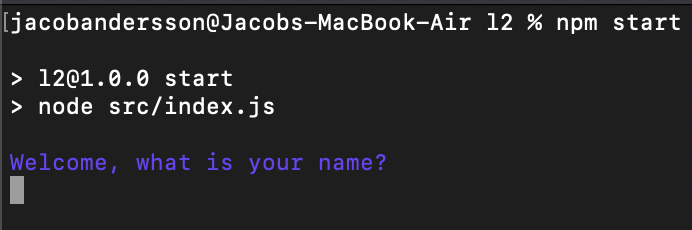
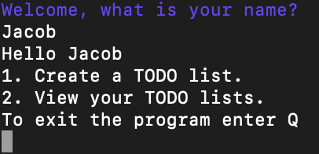
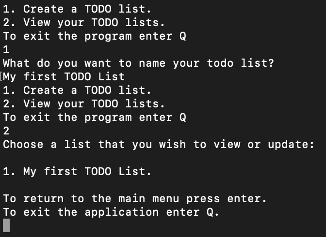
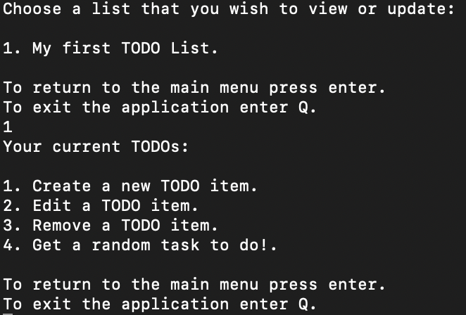
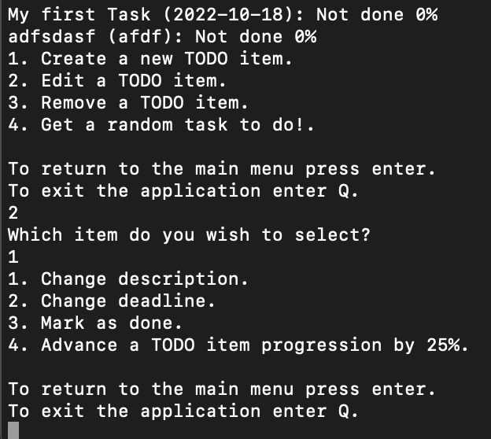

## L1 MODULE USED
https://github.com/jacoobanderson/1DV610-L1

## Description of application
This application is a tool which can help people keep track of their tasks and allow them to structure their work. The users can create different lists of related things to do as well as create, remove and edit tasks in these lists. There are two parts of this application that are supposed to encourage the user to do their tasks:

1. The progression system which allows the user to seperate the task into smaller pieces and by doing so getting a sense of accomplishment each time they advance the progression. When the progression is at 100% the task is automatically marked as done.

2. The randomizing task system allows the user to get a random task to do which helps the user deciding what to actually do and by doing so making it easier to start.


## Installation

To install this application you do the following:
1. Create a new folder
2. Navigate to that folder in the terminal.
3. Clone the project from the terminal:

```console
    $ git clone https://github.com/jacoobanderson/1DV610-L2.git
```

4. Install the application:

```console
    $ npm install
```

5. Start the application by entering:

```console
    $ npm start
```

## Usage and screenshots

1. When started you get to type your name in and are then met with a welcoming message:



2. You are then navigated to the main menu:



3. To create a list you do the following:



4. You can navigate to the item menu where you can create tasks, remove tasks, edit tasks and randomize tasks:



5. When you have created a task you can choose either to edit or remove a task, you do so by selecting them with the number of which they are ordered in, you can then choose in that menu whether to change the description, the deadline, mark the task as done or advance the progression of the selected task:




