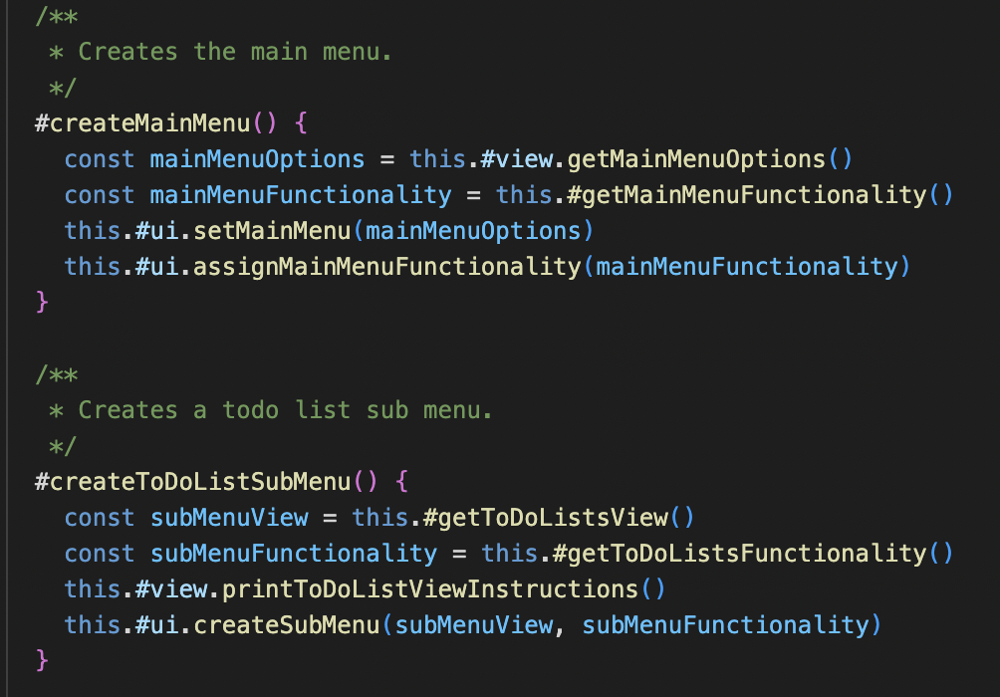
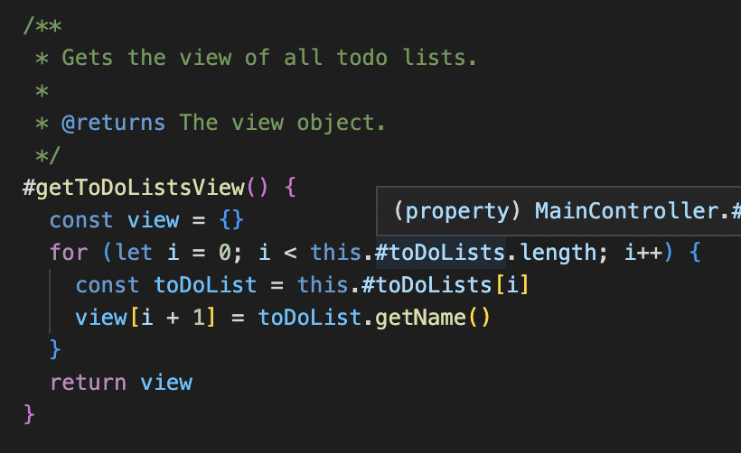
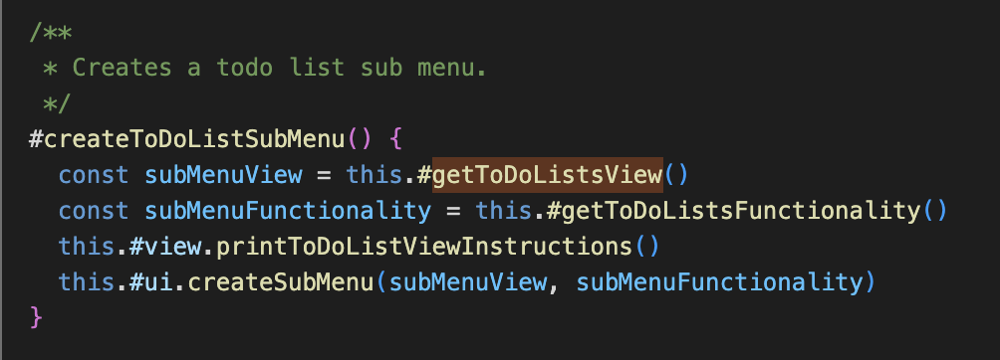
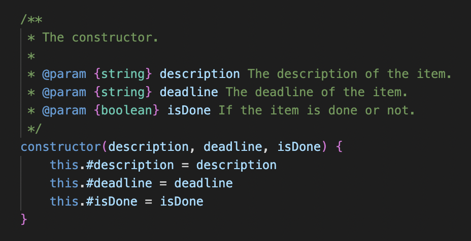
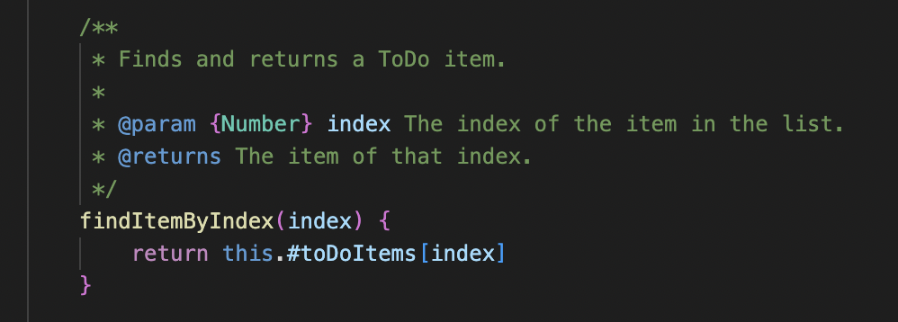
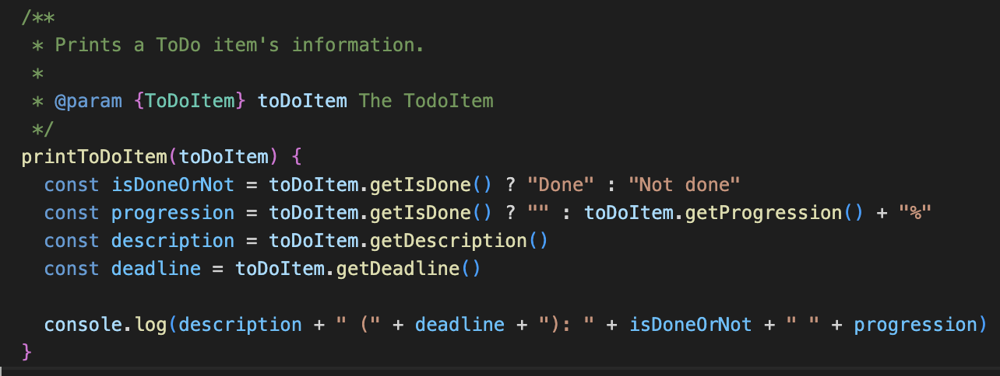
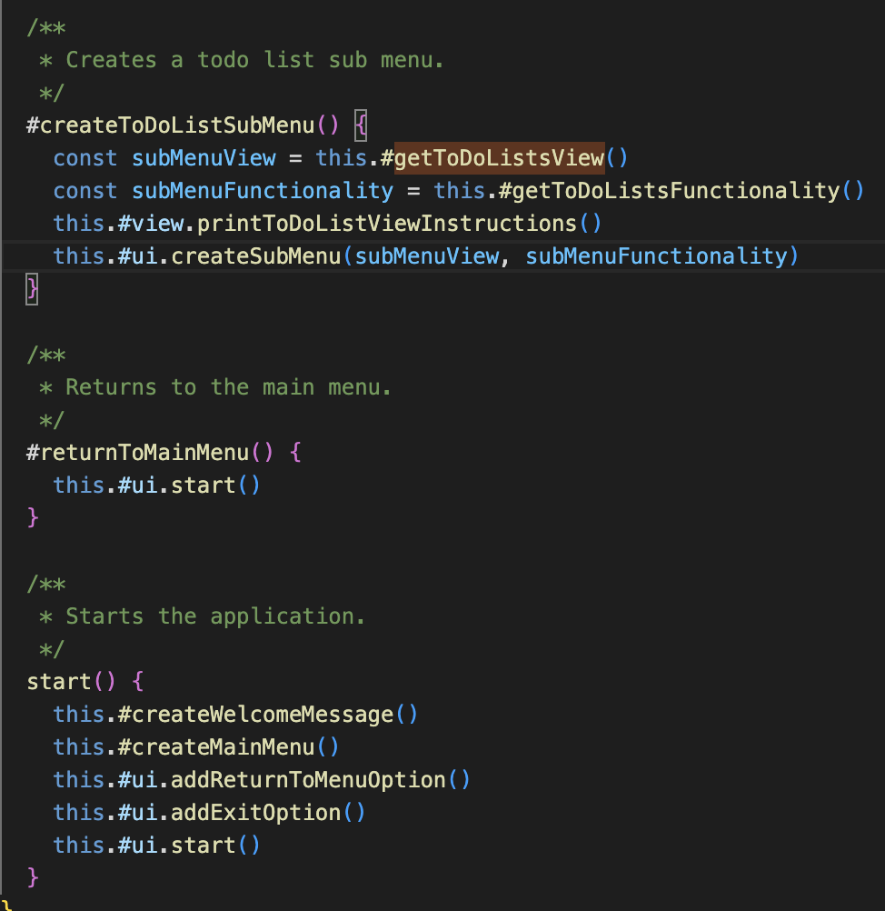
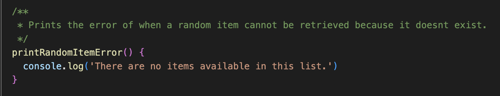
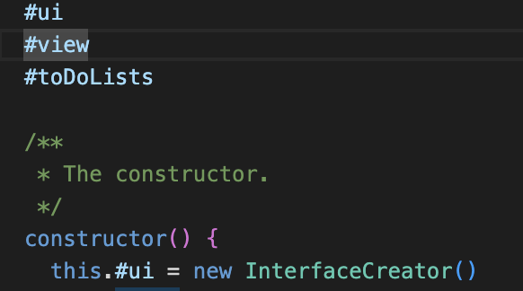

## Reflection CC

### Kapitel 2

Namngivningen har jag följt strikt när det kommer till att ha metoder som verb och variabler som substantiv vilket är någonting jag följt genomgående i applikationen, jag har försökt göra dem alla "intention revealing" vilket jag anser att jag lyckats med. Det detta gjort är att vissa namn är längre än jag kanske skulle viljat men anser att tydligheten väger upp det. Jag har även följt "pick one word per concept" speciellt där jag använder "create" som jag använder för att skapa menyer på högnivå, detta kunde dock göras bättre då det finns metoder som skapar specifika saker som "createToDoItem" där create också är det bästa alternativet då det visar exakt vad det faktiskt gör.

### Kapitel 3

När det kommer till funktionerna har jag lagt fokus på "Do on thing" och "small" vilket jag tycker går hand i hand. Dessa två gör det mycket tydligare men skapar en konflikt med namngivning då fler namn har liknande betydelse/kategori vilket kan göra detta otydligt, detta försökte jag göra bra men det var ändå en utmaning. Det jag tycker att jag lyckats mycket bättre med är utöver de nämnda delarna att hålla samma abstraktions nivå vilket även det blir enklare med "Do one thing" och "small", nedan kan vi se hur funktioner är uppdelade och därmed har en funktion med lägre abstraktions nivå och en med hög:

### Kapitel 4

Kommentarer är någonting jag undvikit och har försökt komma fram till samma funktion genom bra namngivning och tydlig kod vilket jag tycker jag lyckats med. Det jag valt att använda mig av är JSDoc som ger en snabb beskrivning av koden men viktigast av allt beskriver typer som ska användas som argument i metoderna, någonting som jag tycker är oerhört viktigt i ett språk som inte behöver/använder sig av detta. Genom att fokusera på koden och namngivning har jag undvikit att skriva kommentarer mitt i funktioner vilket endast gör det svårare/onödigt. Enligt boken kan det vara onödigt att exempelvis ha JSDoc på varje metod och någonting jag kunde gjort är att endast använda det på de metoder som har användning av det enligt det jag nämnde tidigare om typer.
Där jag anser det vara bra med JSDoc:

### Kapitel 5

Formatteringen är någonting jag lyckats bra med och tycker verkligen att det gör väldigt stor skillnad med indentation, samla ihop kod som är starkt relaterat samt sätta koden nära sin användning. Det gör det väldigt mycket enklare att förstå koden speciellt genom indentation då man får hjälp med att förstå vad som tillhör vad. Det finns nog förbättringsmöjligheter när det kommer till att ha kod som är relaterad till annan kod nära varandra vilket i sin tur skulle förbättra "flödet av läsandet" och ge en mer naturlig förståelse av vad som händer och i vilket ordning. Exempel på där jag samlar ihop relaterad kod:

### Kapitel 6

Abstraktion är någonting jag ständigt tänkt på under denna uppgiften, detta är någonting jag löst genom att göra de metoder som kan vara privata till privata. Då jag använder mig av "MainController" ges jag möjligheten att göra samtliga metoder private förutom den metod som startar igång applikationen. Denna klass kontrollerar alltså alla de andra och på så sätt gömmer de klasserna under. Men jag har även använt mig av privata metoder på samtliga ställen där ett utomstående objekt inte behöver/bör ha åtkomst. Detta är någonting jag märkt blivit ännu mer av när man skapar fler mindre metoder vilket möjliggör att man kan gömma en stor del av funktionaliteten. Nedan kan man se hur den enda metod som ges åtkomst till är "start" som har ansvar för att köra igång applikationen:

### Kapitel 7

Felhanteringen är det jag är missnöjd med i denna inlämning då jag har möjlighet att göra det på ett väldigt snyggt sätt genom att kasta undantag och använda mig av try catch och på grund av att jag fokuserat stort på abstraktionsnivåer hade jag kunnat göra try catch statements på ett snyggt sätt som inte försämrar förståelsen. Det finns flera ställen där undantag bör kastas exempelvis vid fel input och liknande. Detta är någonting jag skulle kunnat gjort i "ToDoView" som ansvarar för input, genom att dela upp undantag samt dess meddelande i egna funktioner och sedan satt in dem på lämplig plats hade det ej förstört förståelsen betydligt. Nedan är ett ställe där jag kunde använt mig av samma koncept men istället kastat ett undantag med liknande meddelande.

### Kapitel 8

Boundaries är någonting som mindre fokus lagts på då modulen jag använder mig är den jag skrivit själv vilket ger mig koll på vad den faktiskt gör och hur den är testat och att den fungerar. Jag kunde ha skrivit nya tester där modulen ingår för att säkerställa att den fungerar som den ska, speciellt om det var en modul jag inte skapat. Det jag kan säga att jag gjort är att jag initierat modulen på ett sätt som inte exponeras för andra klasser i och med att jag skapar den i MainController. Screenshot nedan:

### Kapitel 9

Jag använder mig inte av unit tests i denna inlämningen men det är absolut någonting jag kunde gjort, jag valde istället att köra på manuell testning. Det jag skulle kunnat göra är att skapa test för exempelvis skapandet av ett TODO item där jag får med "Single concept test" och enkelt kunnat dela upp det hela för att även hålla mig till "one assert per test". Att testa skapandet av ett TODO item skulle också vara en bra avgränsning för att uppfylla F.I.R.S.T speciellt "Fast" då det är en liten del som testas.

### Kapitel 10

Jag har skapat både sämre och bättre klasser om man följer bokens regler, små klasser som uppfyller SRP och har "high cohesion" är ToDoItem och ToDoList då de båda har ett ansvar samtidigt som de inte har särskild många instans variabler att hantera. Där jag misslyckades att få samma effekt är inom maincontroller och toDoView, dessa har mer ansvar och kunde delats upp i mindre klasser och därmed kunnat ha endast ett ansvar. Exempel på detta skulle kunna vara ItemMenuView eller ItemController. Få attribut att hantera och endast ansvar för dessa som tillhör klassen:

### Kapitel 11

Systemet är inte helt skapat för att separera "construction from use" vilket jag kunde gjort bättre genom att antingen använde mig av Dependency injection istället för att att skapa objekten i MainController. Jag kunde även gjort en klass som omfattar även maincontroller och på så sätt skapat objekten i denna och sedan använt mig av dependency injection. Det jag gjort för att uppnå viss abstraktion är ändå MainController som hanterar funktionaliteten utan att avslöja underliggande funktionalitet. Det hade varit en bättre idé att utgå från att jag skulle använda dependency injection från början och på så sätt behövt anpassa utformningen av mina klasser och därmed möjligtvis uppnått ett mer löst kopplat system.
